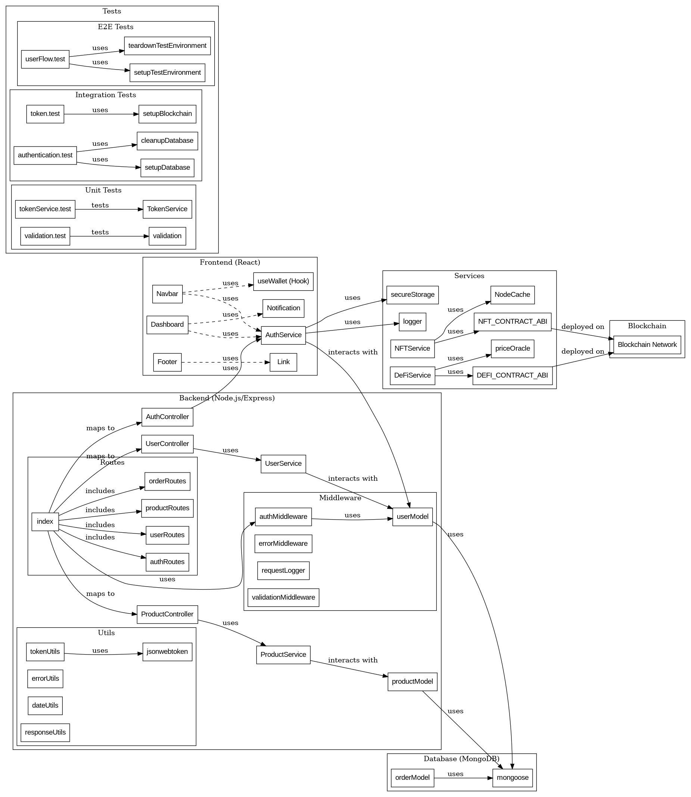

# System Architecture Overview

## Introduction
This document provides an overview of the system architecture for the Hyper Revoluter Core application.

## Architecture Diagram

## Components
1. **Frontend**
   - Description of the frontend technology stack (e.g., React, Vue.js).
   - Communication with the backend via RESTful APIs.

2. **Backend**
   - Description of the backend technology stack (e.g., Node.js, Express).
   - Handles business logic, data processing, and API requests.

3. **Database**
   - Type of database used (e.g., MongoDB, PostgreSQL).
   - Overview of the data models and relationships.

4. **Blockchain**
   - Description of the blockchain integration.
   - Overview of smart contracts and their roles.

## Deployment
- Overview of the deployment process (e.g., Docker, Kubernetes).
- Description of the CI/CD pipeline.

## Security
- Overview of security measures in place (e.g., authentication, data encryption).

